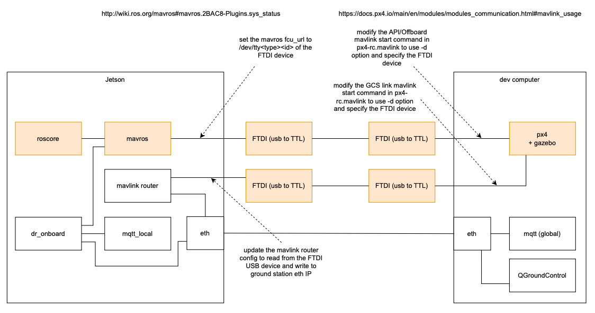

# serial-to-jetson-simulation
This document describes how to run a simulation with one host running the px4 and mqtt services communicating with a Jetson running mavros, mqtt_local, and DR-Onboard (via dev service). 

Additional configurations and prerequisites are discussed in [running_a_simulation_locally](./running_a_simulation_locally.md) and won't be repeated in this document. 

## connection-diagram


## steps-to-run
### on-the-jetson
The Jetson must also be networked to the host running px4 over ethernet assuming the host is also running the system-wide mqtt broker.

Start the dev service and its dependencies specific to the serial connection setup

If `just` is installed:
```bash
just start-drone jetson-dr-controller
```

Othewise:
```bash
docker compose -f ./docker/drone/jetson-dr-controller.yaml up
```

### host-connected-via-serial-to-a-jetson
The `OFFBOARD_SERIAL_DEVICE` and `GCS_SERIAL_DEVICE` environment variables for the px4_serial docker-compose service are respectively set to `/dev/ttyMAVROS` and `/dev/ttyGCS`. On whatever (linux) machine you are using to run the px4_serial service, you must first attach your ftdi usb to ttl serial converters and [symlink them](https://github.com/DroneResponse/DR-Hardware/blob/main/docs/flash_forecr_jetson_orin_nx.md#symlink-ftdi-devices) to the `/dev/ttyMAVROS` and `/dev/ttyGCS` device paths. Then connect each ftdi device to its respective serial device on the jetson - ie. match ttyGCS to ttyGCS. 

Start the px4_serial service
```bash
just simulate-px4-serial
```

Running a simulation requires the Ground Control services to be running. In order to start those ensure you have cloned the [Ground-Control-Services](https://github.com/DroneResponse/Ground-Control-Services) repo.

Once cloned start the `air-lease` service. This will start both itself and an `mqtt` broker available at `localhost:1883`.

```bash
docker compose up air-lease
```

or without logging in the terminal

```bash
docker compose up -d air-lease
```

In another terminal window, send a mission to the jetson:
```bash
just send-mission <mission name within missions directory witout file ending> <drone name>
```

exmaple:
```bash
just send-mission peppermint/big-circle Polkadot
```

## test-mavlink-router-connection
### host-connected-via-serial-to-a-Jetson
This setup assumes that only the GCS communication will be streaming over serial. The offboard stream will be connected to a mavros service. The point is to isolate the GCS stream over serial for a test. 

In the `docker-compose.yml` under the `px4_serial` service, make sure to set the `GCS_SERIAL_DEVICE` environment variable to the serial device responsible for streaming the GCS data. Also, expose that same device from the host to the container under the devices section. 

The `OFFBOARD_SERIAL_DEVICE` can be left blank
```yml
environment:
    ...
    - OFFBOARD_SERIAL_DEVICE=
    - GCS_SERIAL_DEVICE=/dev/ttyGCS
```

px4 mavlink and vehicle (post) configs reference the above environment variables to determine whether the default UDP stream should be started vs a stream over the specified serial device. If a vairable is left blank, the default UDP stream is started. 

Start the `px4_serial` docker compose service with the `mavros_0`` service dependency. 
```bash
docker compose up --no-deps mavros_0 px4_serial
```

### on-the-jetson
Find the `./mavlink-router/main.conf` file and under the `UdpEndpoint GCS` section, update the ip address to whatever host on the network is running QGroundControl.

Make sure to expose the serial device handling the GCS stream from px4 on the other host to the `mavlink_router` service containers under the devices section.

```bash
docker compose build mavlink_router
docker compose up mavlink_router
```